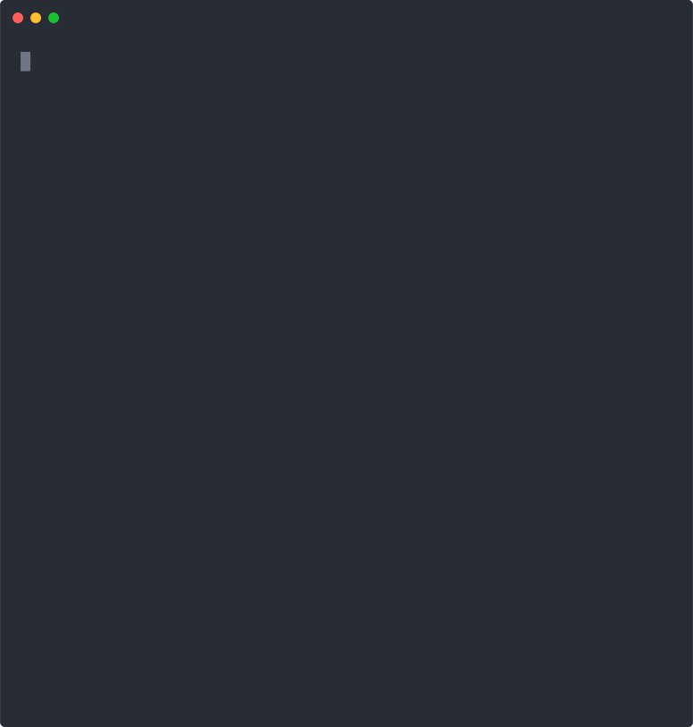

# Demos

Every command, every option, every error case. One action per demo.

## Patterns

### Hex prefix
`git vanity cafe`

### Preset hex word
`git vanity -p coffee`

### Random preset
`git vanity -r`

### Repeat pattern
`git vanity repeat:3` — any 3 identical adjacent chars

### Pair pattern
`git vanity xx` — any 2 identical adjacent chars

### Structured pattern
`git vanity aaxxx` — prefix `aa` + 3 identical chars

### Regex pattern
`git vanity "/^dead/"`

## Match Position

### End of hash
`git vanity dead -m end`

### Anywhere in hash
`git vanity cafe -m contains`

## Options

### Dry run — preview before writing
`git vanity cafe -n`

### Debug — show speed and stats
`git vanity cafe -d`

### Quiet vs normal — progress bar comparison
Without `-q` shows progress bar, with `-q` silent until done

### Threads — control parallelism
`git vanity cafe -j 2 -d`

### Timeout — abort after time limit
`git vanity 00000000 -t 2000`

### Max attempts — abort after N tries
`git vanity 00000000 --max-attempts 1000`

### Message override
`git vanity cafe --message "new message"`

### No repeat — disable structured detection
`git vanity aaxxx --no-repeat`

### List presets — all available hex words
`git vanity --list-presets`

## Subcommands

### Show — inspect current commit
`git vanity show`

### Log — vanity stats for repo
`git vanity log`

### Undo — strip nonce, restore original hash
`git vanity undo`

## Error Cases

### Invalid pattern
`git vanity xyz`

### Unknown preset
`git vanity -p banana`

### Invalid match position
`git vanity cafe -m middle`

### No pattern specified
`git vanity`

### Not a git repo
`git vanity cafe` (outside a repo)

